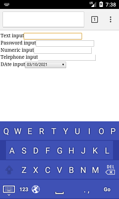
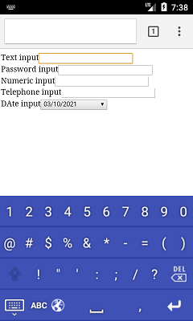
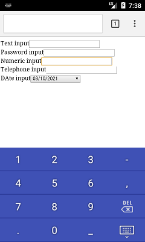

# Description

This is a basic Android keyboard based on the soft keyboard sample found here:

`https://android.googlesource.com/platform/development/+/refs/heads/kitkat-release/samples/SoftKeyboard/`

# Screenshot

    

# Testing

The keyboard can be tested with this: [Github page](https://sajonoso.github.io/android-basix-keyboard)